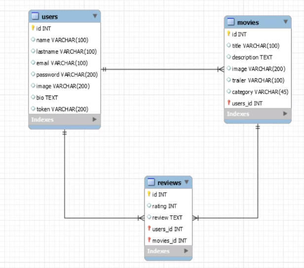

# BubbleMovies
Projetinho em andamento para fins educativos utilizando PHP, MySQL, HTML, CSS e Bootstrap. 

## Configuração
Para rodar o projeto localmente é necessário o servidor Apache e o MySQL. Utilizei o [WampServer](https://www.wampserver.com/), porém há outras alternativas como o [Laragon](https://laragon.org/).

```php
   $dbname = "";
   $login = "";
   $password = "";
```


## Screenshots




## Professor que auxiliou no projeto

- [@matheusbattisti](https://github.com/matheusbattisti)


