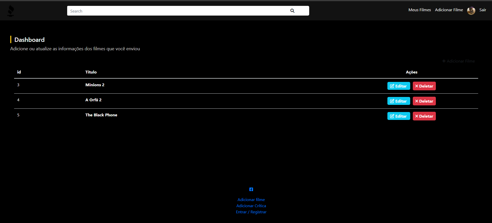

# BubbleMovies
Projetinho em andamento para fins educativos utilizando PHP, MySQL, HTML, CSS e Bootstrap. 

# Requisitos
- PHP
- MySQL

## Configuração
Para rodar o projeto localmente é necessário o servidor Apache e o MySQL. Utilizei o [WampServer](https://www.wampserver.com/), porém há outras alternativas como o [Laragon](https://laragon.org/).

```php
   $dbname = "";
   $login = "";
   $password = "";
```

## Em andamento
- [x]  Setup do Banco de dados
- [x]  HTML e CSS
- [x]  Validação e autenticação do usuário
- [x]  Criação dos Filmes 
- [x]  Criação das Reviews
- [ ]  Alterar estilo
- [ ]  Adicionar novas funcionalidades
- [ ]  Fazer a aplicação consumir a API themoviedb


## Screenshots





## Professor que auxiliou no projeto

- [@matheusbattisti](https://github.com/matheusbattisti)


